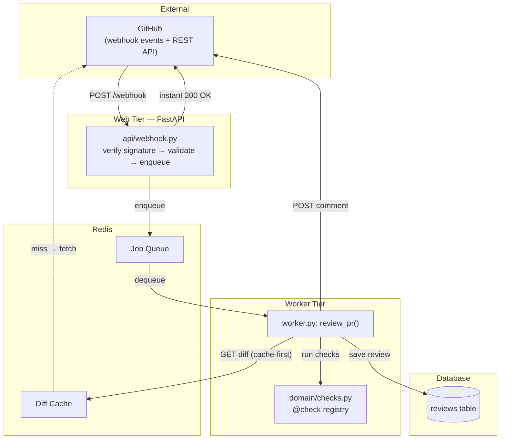

# github-review-bot

A GitHub pull-request review bot: a webhook receiver fetches a PR's diff,
runs a set of automated checks against it, and posts the results back as
a comment — a lightweight first-pass reviewer that catches the
mechanical stuff so human reviewers can focus on judgment calls.

## Architecture



## Project layout

```
app/
  main.py            FastAPI app + lifespan wiring
  config.py          pydantic-settings, one source of truth for env vars
  payloads.py        GitHub webhook payload models
  api/                HTTP routes (webhook, history, health)
  domain/              pure logic: signature verification, diff parsing, checks
  infra/                GitHub client, DB, Redis cache, queue
  worker.py            background job(s) that do the actual review
tests/
```

## Setup

```bash
python -m venv .venv && source .venv/bin/activate
pip install -e ".[dev]"
cp .env.example .env   # fill in GITHUB_TOKEN and WEBHOOK_SECRET
```

## Tasks

- [x] Set up project structure (`app/`, `domain/`, `infra/`, `api/`, `tests/`)
- [x] Write `verify_signature()` — HMAC-SHA256 webhook signature check
- [x] Write `parse_diff()` — split a unified diff into per-file added/removed lines
- [x] Build the `@check` registry and `run_all_checks()` / `format_findings()`
- [x] Add `no_todo_comments` check
- [x] Add `diff_size` check
- [x] Write `config.py` — validated settings via pydantic-settings
- [x] Write `GitHubClient.get_pr_diff()` — async fetch, with `follow_redirects=True`
- [x] Confirm a real diff fetch + check run works end to end (`scratch.py`)
- [ ] Define `PullRequestPayload` for the webhook body
- [ ] Wire up `main.py` with `lifespan` and a shared `httpx.AsyncClient`
- [ ] Build the `/webhook` route: verify → validate → fetch diff → run checks
- [ ] Test signature rejection on the live endpoint (401 case)
- [ ] Confirm the full happy path via a signed `curl` request
- [ ] Add `GitHubClient.post_review_comment()` and call it from the webhook flow
- [ ] Add Redis + a job queue so the webhook responds before the review finishes
- [ ] Persist each review (`Review` model + repository, dedup on PR + commit SHA)
- [ ] Add `/history` and `/stats` read endpoints
- [ ] Cache diff fetches to reduce GitHub API calls
- [ ] Add retry/backoff and rate-limit handling around GitHub calls
- [ ] Add a `/health` endpoint (DB, Redis, GitHub reachability)
- [ ] Write Dockerfile + docker-compose for web, worker, Redis, Postgres
- [ ] Add CI (lint + tests) on push